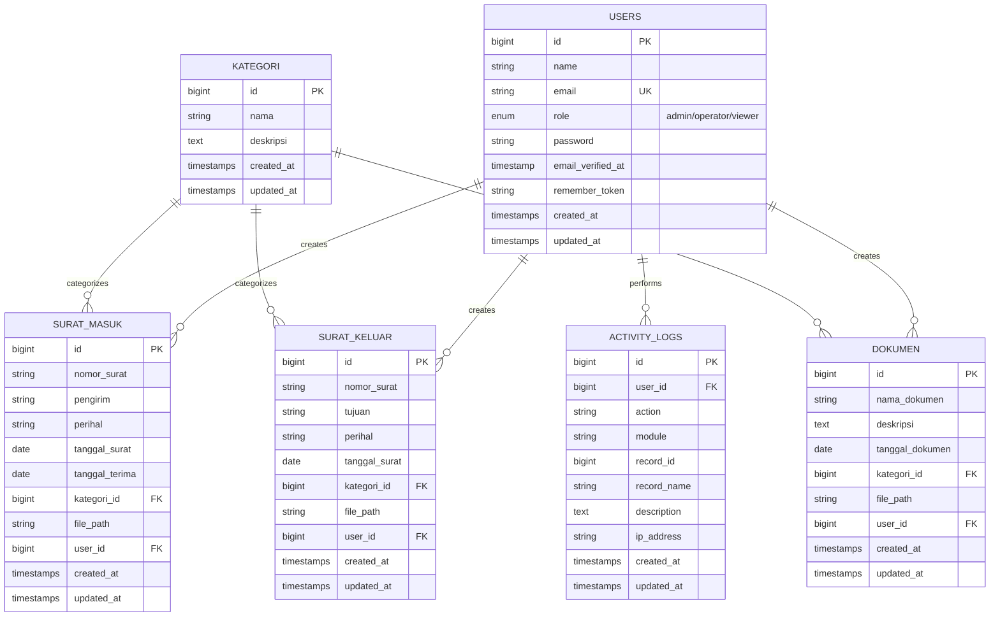
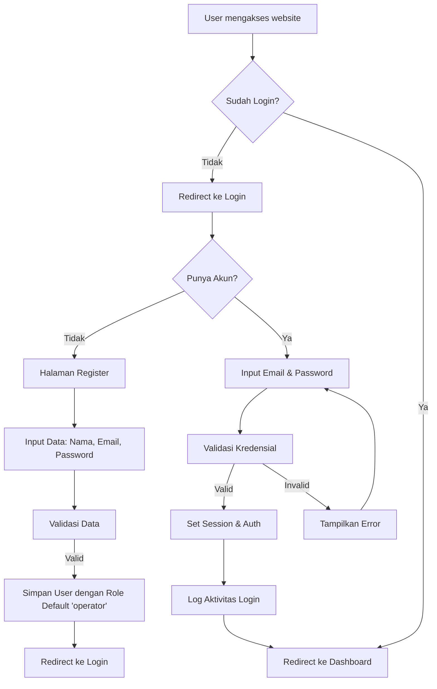
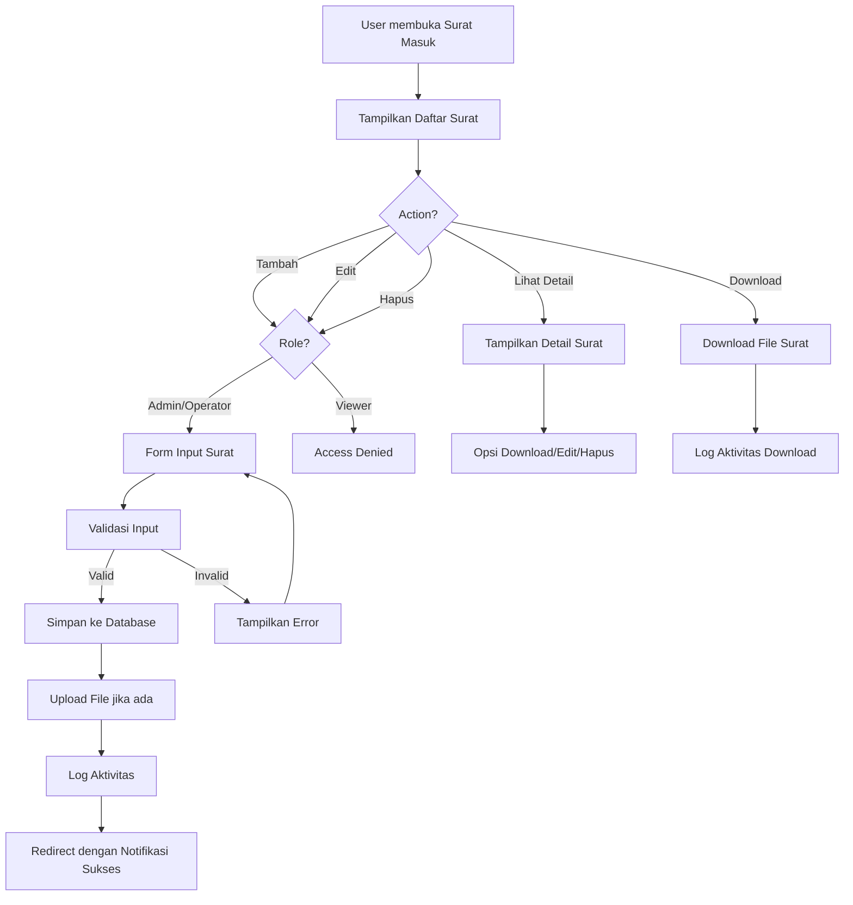
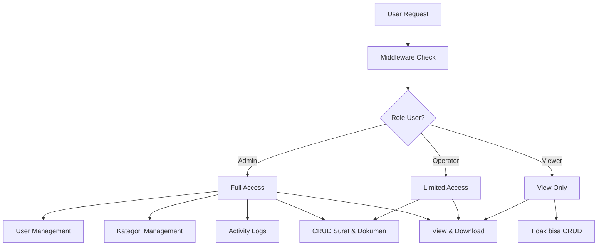
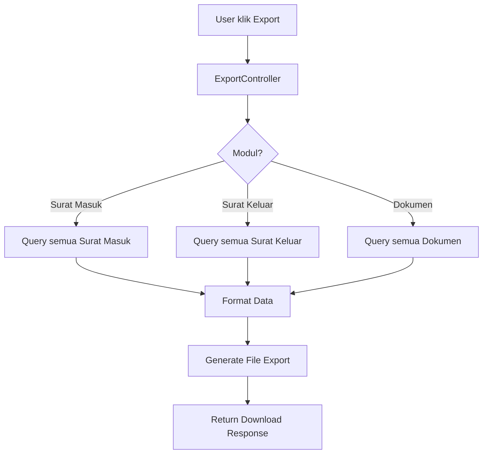

# 📨 Sistem Pengarsipan Surat dan Dokumen

Sistem manajemen arsip digital berbasis web untuk mengelola surat masuk, surat keluar, dan dokumen penting dengan fitur lengkap termasuk role-based access control, activity logging, dan export data.


---

## 📋 Daftar Isi

- [Tentang Sistem](#-tentang-sistem)
- [Fitur Utama](#-fitur-utama)
- [Teknologi yang Digunakan](#-teknologi-yang-digunakan)
- [Arsitektur Sistem](#-arsitektur-sistem)
- [Struktur Database](#-struktur-database)
- [Alur Sistem](#-alur-sistem)
- [Role & Hak Akses](#-role--hak-akses)
- [Instalasi](#-instalasi)
- [Konfigurasi](#-konfigurasi)
- [Screenshots](#-screenshots)

---

## 📖 Tentang Sistem

**Sistem Pengarsipan Surat dan Dokumen** adalah aplikasi web berbasis Laravel yang dirancang untuk membantu instansi, organisasi, atau perusahaan dalam mengelola arsip surat dan dokumen secara digital. Sistem ini menyediakan solusi lengkap untuk:

- **Pencatatan** surat masuk dan surat keluar secara terstruktur
- **Penyimpanan** dokumen digital dengan kategorisasi yang jelas
- **Pencarian** arsip dengan filter berdasarkan berbagai kriteria
- **Pelaporan** dan export data dalam format yang dapat digunakan
- **Audit trail** untuk melacak semua aktivitas pengguna

---

## 🎯 Mengapa Project Ini Dibuat?

Project **Sistem Pengarsipan Surat dan Dokumen** dibuat untuk **mendigitalkan proses pengelolaan arsip** di instansi, organisasi, perusahaan, atau lembaga pendidikan. Sistem ini menggantikan metode pengarsipan konvensional (kertas/manual) yang memiliki banyak kelemahan.

### ❌ Masalah yang Diselesaikan

| Masalah Manual | Solusi Digital |
|----------------|----------------|
| Surat/dokumen mudah hilang atau rusak | Tersimpan aman di database dan server |
| Pencarian arsip memakan waktu lama | Fitur search dan filter instan |
| Sulit melacak siapa yang mengakses | Activity log mencatat semua aktivitas |
| Tidak ada backup data | Data tersimpan di database dengan backup |
| Keterbatasan ruang penyimpanan fisik | Storage digital tanpa batas fisik |
| Sulit berbagi dokumen antar bagian | Akses online dari mana saja |

---

## ✅ Kegunaan Utama Project

### 1. **Pengelolaan Surat Masuk**
- Mencatat semua surat yang diterima instansi
- Menyimpan informasi: nomor surat, pengirim, perihal, tanggal terima
- Upload scan/foto surat asli
- Mudah dicari berdasarkan nomor, pengirim, atau tanggal

### 2. **Pengelolaan Surat Keluar**
- Mencatat semua surat yang dikirim ke pihak luar
- Menyimpan informasi: nomor surat, tujuan, perihal, tanggal kirim
- Arsip digital surat yang dikirim
- Tracking riwayat korespondensi

### 3. **Pengelolaan Dokumen Umum**
- Menyimpan dokumen penting (SK, kontrak, laporan, dll)
- Kategorisasi berdasarkan jenis dokumen
- Deskripsi dan tanggal dokumen
- Akses cepat ke dokumen yang diperlukan

### 4. **Kategorisasi Arsip**
- Mengelompokkan surat/dokumen berdasarkan kategori
- Contoh kategori: Kepegawaian, Keuangan, Operasional, Umum
- Memudahkan pencarian dan pengorganisasian

### 5. **Kontrol Akses (Role-Based)**
- **Admin**: Akses penuh (kelola user, kategori, semua data)
- **Operator**: Input dan edit surat/dokumen
- **Viewer**: Hanya lihat dan download (tidak bisa edit)

### 6. **Audit Trail (Activity Log)**
- Mencatat siapa, kapan, dan aksi apa yang dilakukan
- Untuk keamanan dan akuntabilitas
- Melacak perubahan data

### 7. **Export Data**
- Export data surat dan dokumen ke file
- Untuk keperluan laporan dan backup

---

## 🏢 Siapa yang Membutuhkan Sistem Ini?

| Target Pengguna | Kegunaan |
|-----------------|----------|
| **Kantor Pemerintahan** | Arsip surat dinas, disposisi, regulasi |
| **Perusahaan** | Kontrak, memo internal, surat keluar |
| **Sekolah/Universitas** | Surat keputusan, sertifikat, dokumen akademik |
| **Rumah Sakit** | Surat rujukan, dokumen administrasi |
| **Organisasi** | Proposal, laporan kegiatan, surat undangan |

---

## 💡 Manfaat Nyata

1. **Efisiensi Waktu** - Pencarian arsip dalam hitungan detik
2. **Hemat Ruang** - Tidak perlu lemari arsip fisik
3. **Keamanan Data** - Password protected + role access
4. **Aksesibilitas** - Bisa diakses dari mana saja (jika di-deploy online)
5. **Akuntabilitas** - Semua aktivitas tercatat
6. **Backup Otomatis** - Data tidak hilang seperti dokumen fisik
7. **Kolaborasi** - Banyak user bisa mengakses bersamaan

---

## 📊 Contoh Skenario Penggunaan

### Skenario 1: Staf Administrasi Sekolah
> Menerima surat undangan dari Dinas Pendidikan → Login sebagai Operator → Input data surat masuk → Upload scan surat → Surat tersimpan dan bisa diakses Kepala Sekolah

### Skenario 2: Kepala Bagian
> Perlu mencari surat masuk dari 3 bulan lalu → Login → Buka menu Surat Masuk → Filter berdasarkan tanggal → Download file surat yang diperlukan

### Skenario 3: Audit Internal
> Admin perlu mengecek aktivitas pengguna → Buka Activity Logs → Lihat siapa yang menambah/mengedit/menghapus data

---

## ✨ Fitur Utama

### 📥 Manajemen Surat Masuk
- Pencatatan surat masuk dengan nomor surat, pengirim, perihal, dan tanggal
- Upload file lampiran surat
- Kategorisasi surat berdasarkan jenis
- Pencarian dan filter surat
- Download file surat

### 📤 Manajemen Surat Keluar
- Pencatatan surat keluar dengan nomor surat, tujuan, dan perihal
- Upload file surat keluar
- Tracking tanggal pengiriman
- Kategorisasi dan pencarian

### 📄 Manajemen Dokumen
- Penyimpanan dokumen dengan nama dan deskripsi
- Kategorisasi dokumen
- Upload file dokumen
- Preview dan download dokumen

### 📁 Manajemen Kategori
- Buat, edit, dan hapus kategori
- Kategorisasi untuk surat masuk, surat keluar, dan dokumen
- Organisasi arsip yang terstruktur

### 👥 Manajemen Pengguna
- Authentication (Login & Register)
- Role-based access control (Admin, Operator, Viewer)
- Manajemen profil pengguna
- Password management

### 📊 Dashboard & Statistik
- Overview statistik total surat dan dokumen
- Daftar surat dan dokumen terbaru
- Navigasi cepat ke fitur utama

### 📋 Activity Logging
- Pencatatan semua aktivitas pengguna
- Tracking create, update, delete, dan download
- Catatan IP address untuk audit

### 📥 Export Data
- Export data surat masuk ke file
- Export data surat keluar ke file
- Export data dokumen ke file

---

## 🛠 Teknologi yang Digunakan

| Komponen | Teknologi |
|----------|-----------|
| **Backend Framework** | Laravel 10.x |
| **Bahasa Pemrograman** | PHP 8.1+ |
| **Database** | MySQL 8.0 |
| **Frontend** | Blade Template Engine |
| **CSS Framework** | Bootstrap / Custom CSS |
| **Authentication** | Laravel Sanctum |
| **File Storage** | Laravel Storage |

---

## 🏗 Arsitektur Sistem

Sistem ini menggunakan arsitektur **MVC (Model-View-Controller)** yang merupakan standar Laravel:

```
┌─────────────────────────────────────────────────────────────────┐
│                        CLIENT (Browser)                         │
└─────────────────────────┬───────────────────────────────────────┘
                          │
                          ▼
┌─────────────────────────────────────────────────────────────────┐
│                      ROUTING (web.php)                          │
│  ┌─────────────┐  ┌──────────────┐  ┌────────────────────────┐ │
│  │ Guest Routes│  │ Auth Routes  │  │ Role-based Routes      │ │
│  │ - Login     │  │ - Dashboard  │  │ - Admin Only           │ │
│  │ - Register  │  │ - Profile    │  │ - Admin & Operator     │ │
│  └─────────────┘  └──────────────┘  └────────────────────────┘ │
└─────────────────────────┬───────────────────────────────────────┘
                          │
                          ▼
┌─────────────────────────────────────────────────────────────────┐
│                    MIDDLEWARE LAYER                             │
│  ┌─────────────┐  ┌──────────────┐  ┌────────────────────────┐ │
│  │ Auth        │  │ Guest        │  │ Role Middleware        │ │
│  │ Middleware  │  │ Middleware   │  │ (CheckRole)            │ │
│  └─────────────┘  └──────────────┘  └────────────────────────┘ │
└─────────────────────────┬───────────────────────────────────────┘
                          │
                          ▼
┌─────────────────────────────────────────────────────────────────┐
│                       CONTROLLERS                               │
│  ┌─────────────────┐  ┌─────────────────┐  ┌─────────────────┐ │
│  │ AuthController  │  │ DashboardCtrl   │  │ SuratMasukCtrl  │ │
│  │ - login         │  │ - index         │  │ - CRUD          │ │
│  │ - register      │  │                 │  │ - download      │ │
│  │ - logout        │  │                 │  │                 │ │
│  └─────────────────┘  └─────────────────┘  └─────────────────┘ │
│  ┌─────────────────┐  ┌─────────────────┐  ┌─────────────────┐ │
│  │ SuratKeluarCtrl │  │ DokumenCtrl     │  │ KategoriCtrl    │ │
│  │ - CRUD          │  │ - CRUD          │  │ - CRUD          │ │
│  │ - download      │  │ - download      │  │                 │ │
│  └─────────────────┘  └─────────────────┘  └─────────────────┘ │
│  ┌─────────────────┐  ┌─────────────────┐  ┌─────────────────┐ │
│  │ UserController  │  │ ProfileCtrl     │  │ ActivityLogCtrl │ │
│  │ - CRUD          │  │ - show          │  │ - index         │ │
│  │                 │  │ - update        │  │                 │ │
│  └─────────────────┘  └─────────────────┘  └─────────────────┘ │
│  ┌─────────────────┐                                            │
│  │ ExportController│                                            │
│  │ - exportSuratM  │                                            │
│  │ - exportSuratK  │                                            │
│  │ - exportDokumen │                                            │
│  └─────────────────┘                                            │
└─────────────────────────┬───────────────────────────────────────┘
                          │
                          ▼
┌─────────────────────────────────────────────────────────────────┐
│                         MODELS                                  │
│  ┌──────────┐  ┌───────────┐  ┌────────────┐  ┌──────────────┐ │
│  │ User     │  │ SuratMasuk│  │ SuratKeluar│  │ Dokumen      │ │
│  └──────────┘  └───────────┘  └────────────┘  └──────────────┘ │
│  ┌──────────┐  ┌────────────────┐                               │
│  │ Kategori │  │ ActivityLog    │                               │
│  └──────────┘  └────────────────┘                               │
└─────────────────────────┬───────────────────────────────────────┘
                          │
                          ▼
┌─────────────────────────────────────────────────────────────────┐
│                     DATABASE (MySQL)                            │
│  ┌──────────┐  ┌───────────┐  ┌────────────┐  ┌──────────────┐ │
│  │ users    │  │surat_masuk│  │surat_keluar│  │ dokumen      │ │
│  └──────────┘  └───────────┘  └────────────┘  └──────────────┘ │
│  ┌──────────┐  ┌────────────────┐                               │
│  │ kategori │  │ activity_logs  │                               │
│  └──────────┘  └────────────────┘                               │
└─────────────────────────────────────────────────────────────────┘
```

---

## 🗃 Struktur Database

### Entity Relationship Diagram (ERD)



### Detail Tabel

#### 1. Tabel `users`
Menyimpan data pengguna sistem.

| Kolom | Tipe | Keterangan |
|-------|------|------------|
| `id` | BIGINT | Primary Key, Auto Increment |
| `name` | VARCHAR | Nama lengkap pengguna |
| `email` | VARCHAR | Email (unique) |
| `role` | ENUM | Role: 'admin', 'operator', 'viewer' |
| `email_verified_at` | TIMESTAMP | Waktu verifikasi email |
| `password` | VARCHAR | Password terenkripsi |
| `remember_token` | VARCHAR | Token "remember me" |
| `created_at` | TIMESTAMP | Waktu pembuatan |
| `updated_at` | TIMESTAMP | Waktu update terakhir |

#### 2. Tabel `kategori`
Menyimpan kategori untuk pengarsipan.

| Kolom | Tipe | Keterangan |
|-------|------|------------|
| `id` | BIGINT | Primary Key, Auto Increment |
| `nama` | VARCHAR | Nama kategori |
| `deskripsi` | TEXT | Deskripsi kategori (nullable) |
| `created_at` | TIMESTAMP | Waktu pembuatan |
| `updated_at` | TIMESTAMP | Waktu update terakhir |

#### 3. Tabel `surat_masuk`
Menyimpan data surat masuk.

| Kolom | Tipe | Keterangan |
|-------|------|------------|
| `id` | BIGINT | Primary Key, Auto Increment |
| `nomor_surat` | VARCHAR | Nomor surat masuk |
| `pengirim` | VARCHAR | Nama/instansi pengirim |
| `perihal` | VARCHAR | Perihal surat |
| `tanggal_surat` | DATE | Tanggal surat |
| `tanggal_terima` | DATE | Tanggal diterima |
| `kategori_id` | BIGINT | FK ke tabel kategori |
| `file_path` | VARCHAR | Path file surat (nullable) |
| `user_id` | BIGINT | FK ke tabel users (perekam) |
| `created_at` | TIMESTAMP | Waktu pembuatan |
| `updated_at` | TIMESTAMP | Waktu update terakhir |

#### 4. Tabel `surat_keluar`
Menyimpan data surat keluar.

| Kolom | Tipe | Keterangan |
|-------|------|------------|
| `id` | BIGINT | Primary Key, Auto Increment |
| `nomor_surat` | VARCHAR | Nomor surat keluar |
| `tujuan` | VARCHAR | Nama/instansi tujuan |
| `perihal` | VARCHAR | Perihal surat |
| `tanggal_surat` | DATE | Tanggal surat |
| `kategori_id` | BIGINT | FK ke tabel kategori |
| `file_path` | VARCHAR | Path file surat (nullable) |
| `user_id` | BIGINT | FK ke tabel users (pembuat) |
| `created_at` | TIMESTAMP | Waktu pembuatan |
| `updated_at` | TIMESTAMP | Waktu update terakhir |

#### 5. Tabel `dokumen`
Menyimpan data dokumen umum.

| Kolom | Tipe | Keterangan |
|-------|------|------------|
| `id` | BIGINT | Primary Key, Auto Increment |
| `nama_dokumen` | VARCHAR | Nama dokumen |
| `deskripsi` | TEXT | Deskripsi dokumen (nullable) |
| `tanggal_dokumen` | DATE | Tanggal dokumen |
| `kategori_id` | BIGINT | FK ke tabel kategori |
| `file_path` | VARCHAR | Path file dokumen (nullable) |
| `user_id` | BIGINT | FK ke tabel users (pengunggah) |
| `created_at` | TIMESTAMP | Waktu pembuatan |
| `updated_at` | TIMESTAMP | Waktu update terakhir |

#### 6. Tabel `activity_logs`
Menyimpan log aktivitas pengguna.

| Kolom | Tipe | Keterangan |
|-------|------|------------|
| `id` | BIGINT | Primary Key, Auto Increment |
| `user_id` | BIGINT | FK ke tabel users |
| `action` | VARCHAR | Jenis aksi (create/update/delete/download/login/logout) |
| `module` | VARCHAR | Modul (surat_masuk/surat_keluar/dokumen/kategori/user/auth) |
| `record_id` | BIGINT | ID record yang diakses (nullable) |
| `record_name` | VARCHAR | Nama record (nullable) |
| `description` | TEXT | Deskripsi aktivitas (nullable) |
| `ip_address` | VARCHAR | IP Address pengguna (nullable) |
| `created_at` | TIMESTAMP | Waktu aktivitas |
| `updated_at` | TIMESTAMP | Waktu update |

---

## 🔄 Alur Sistem

### 1. Alur Autentikasi



### 2. Alur Manajemen Surat Masuk



### 3. Alur Role-based Access Control



### 4. Alur Export Data



---

## 👥 Role & Hak Akses

Sistem menggunakan 3 level role dengan hak akses yang berbeda:

| Fitur | Admin | Operator | Viewer |
|-------|:-----:|:--------:|:------:|
| **Dashboard** | ✅ | ✅ | ✅ |
| **Lihat Surat Masuk** | ✅ | ✅ | ✅ |
| **Lihat Surat Keluar** | ✅ | ✅ | ✅ |
| **Lihat Dokumen** | ✅ | ✅ | ✅ |
| **Download File** | ✅ | ✅ | ✅ |
| **Export Data** | ✅ | ✅ | ✅ |
| **Tambah Surat Masuk** | ✅ | ✅ | ❌ |
| **Edit Surat Masuk** | ✅ | ✅ | ❌ |
| **Hapus Surat Masuk** | ✅ | ✅ | ❌ |
| **Tambah Surat Keluar** | ✅ | ✅ | ❌ |
| **Edit Surat Keluar** | ✅ | ✅ | ❌ |
| **Hapus Surat Keluar** | ✅ | ✅ | ❌ |
| **Tambah Dokumen** | ✅ | ✅ | ❌ |
| **Edit Dokumen** | ✅ | ✅ | ❌ |
| **Hapus Dokumen** | ✅ | ✅ | ❌ |
| **Manajemen Kategori** | ✅ | ❌ | ❌ |
| **Manajemen User** | ✅ | ❌ | ❌ |
| **Activity Logs** | ✅ | ❌ | ❌ |

### Deskripsi Role

1. **Admin**
   - Akses penuh ke seluruh fitur sistem
   - Dapat mengelola pengguna (tambah, edit, hapus, ubah role)
   - Dapat mengelola kategori
   - Dapat melihat activity log semua pengguna

2. **Operator**
   - Dapat melakukan CRUD surat masuk, surat keluar, dan dokumen
   - Dapat mengunduh file
   - Dapat mengexport data
   - Tidak dapat mengakses manajemen user dan kategori

3. **Viewer**
   - Hanya dapat melihat data
   - Dapat mengunduh file
   - Dapat mengexport data
   - Tidak dapat menambah, mengedit, atau menghapus data

---

## ⚙️ Instalasi

### Prasyarat
- PHP >= 8.1
- Composer
- MySQL >= 8.0
- Node.js & NPM (untuk asset compilation)

### Langkah Instalasi

1. **Clone Repository**
   ```bash
   git clone <repository-url>
   cd sistem-pengarsipan-surat-dan-dokumen
   ```

2. **Install Dependencies**
   ```bash
   composer install
   npm install
   ```

3. **Setup Environment**
   ```bash
   cp .env.example .env
   php artisan key:generate
   ```

4. **Konfigurasi Database**
   
   Edit file `.env` dan sesuaikan konfigurasi database:
   ```env
   DB_CONNECTION=mysql
   DB_HOST=127.0.0.1
   DB_PORT=3306
   DB_DATABASE=surat_dokumen
   DB_USERNAME=root
   DB_PASSWORD=
   ```

5. **Jalankan Migrasi & Seeder**
   ```bash
   php artisan migrate
   php artisan db:seed
   ```

6. **Buat Symbolic Link untuk Storage**
   ```bash
   php artisan storage:link
   ```

7. **Compile Assets**
   ```bash
   npm run build
   ```

8. **Jalankan Server**
   ```bash
   php artisan serve
   ```

9. **Akses Aplikasi**
   
   Buka browser dan akses: `http://localhost:8000`

---

## 🔧 Konfigurasi

### Environment Variables

| Variable | Deskripsi | Default |
|----------|-----------|---------|
| `APP_NAME` | Nama aplikasi | Sistem Pengarsipan |
| `APP_ENV` | Environment (local/production) | local |
| `APP_DEBUG` | Mode debug | true |
| `DB_CONNECTION` | Jenis database | mysql |
| `DB_HOST` | Host database | 127.0.0.1 |
| `DB_PORT` | Port database | 3306 |
| `DB_DATABASE` | Nama database | surat_dokumen |
| `DB_USERNAME` | Username database | root |
| `DB_PASSWORD` | Password database | - |

### File Upload

File yang diupload disimpan di direktori `storage/app/public/` dengan struktur:
- `surat_masuk/` - File surat masuk
- `surat_keluar/` - File surat keluar
- `dokumen/` - File dokumen

---

## 📁 Struktur Direktori

```
sistem-pengarsipan-surat-dan-dokumen/
├── app/
│   ├── Http/
│   │   ├── Controllers/
│   │   │   ├── ActivityLogController.php
│   │   │   ├── AuthController.php
│   │   │   ├── DashboardController.php
│   │   │   ├── DokumenController.php
│   │   │   ├── ExportController.php
│   │   │   ├── KategoriController.php
│   │   │   ├── ProfileController.php
│   │   │   ├── SuratKeluarController.php
│   │   │   ├── SuratMasukController.php
│   │   │   └── UserController.php
│   │   └── Middleware/
│   │       └── CheckRole.php
│   └── Models/
│       ├── ActivityLog.php
│       ├── Dokumen.php
│       ├── Kategori.php
│       ├── SuratKeluar.php
│       ├── SuratMasuk.php
│       └── User.php
├── database/
│   ├── migrations/
│   │   ├── 2014_10_12_000000_create_users_table.php
│   │   ├── 2026_01_21_000001_create_kategori_table.php
│   │   ├── 2026_01_21_000002_create_surat_masuk_table.php
│   │   ├── 2026_01_21_000003_create_surat_keluar_table.php
│   │   ├── 2026_01_21_000004_create_dokumen_table.php
│   │   ├── 2026_01_21_000005_add_role_to_users_table.php
│   │   └── 2026_01_21_000006_create_activity_logs_table.php
│   └── seeders/
├── resources/
│   └── views/
│       ├── auth/
│       ├── dashboard/
│       ├── dokumen/
│       ├── kategori/
│       ├── layouts/
│       ├── profile/
│       ├── surat-keluar/
│       ├── surat-masuk/
│       └── users/
├── routes/
│   └── web.php
└── storage/
    └── app/
        └── public/
            ├── surat_masuk/
            ├── surat_keluar/
            └── dokumen/
```

---

## 🎨 Screenshots

### Dashboard
Halaman utama yang menampilkan statistik dan ringkasan data surat dan dokumen.

### Surat Masuk
Daftar dan form pengelolaan surat masuk dengan fitur pencarian dan filter.

### Surat Keluar
Daftar dan form pengelolaan surat keluar.

### Dokumen
Daftar dan form pengelolaan dokumen.

### Activity Log
Log aktivitas semua pengguna untuk keperluan audit.

---

## 📝 Lisensi

Sistem ini dikembangkan untuk keperluan internal. Hak cipta dilindungi.

---

## 🤝 Kontribusi

1. Fork repository
2. Buat branch fitur (`git checkout -b feature/AmazingFeature`)
3. Commit perubahan (`git commit -m 'Add some AmazingFeature'`)
4. Push ke branch (`git push origin feature/AmazingFeature`)
5. Buat Pull Request

---

## 📞 Kontak & Dukungan

Untuk pertanyaan dan dukungan, silakan hubungi administrator sistem.
